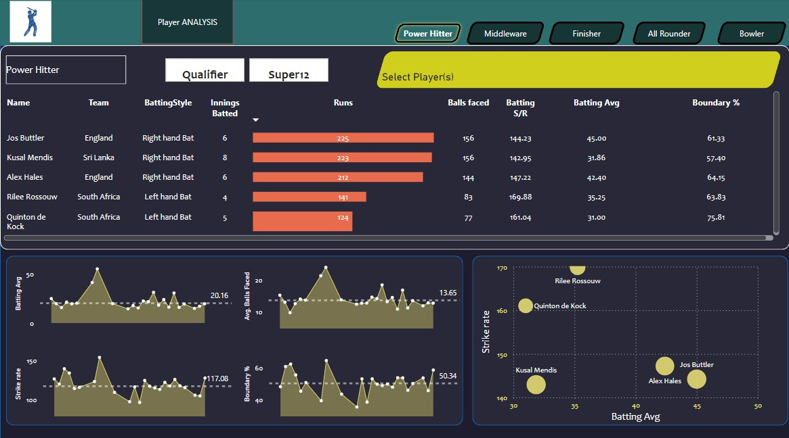
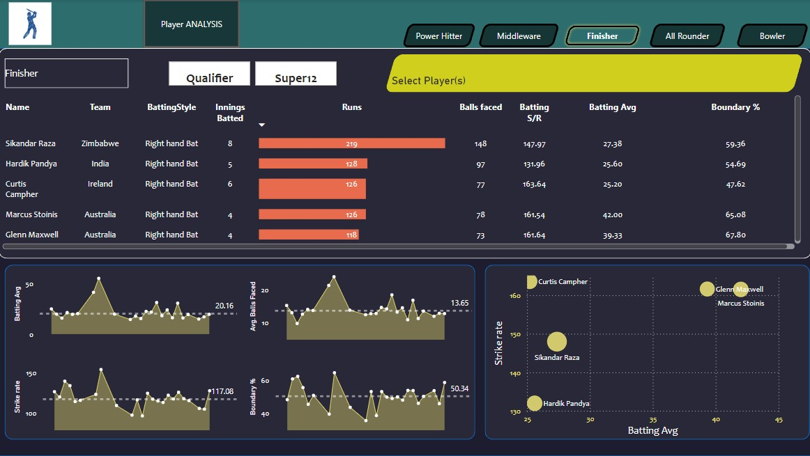
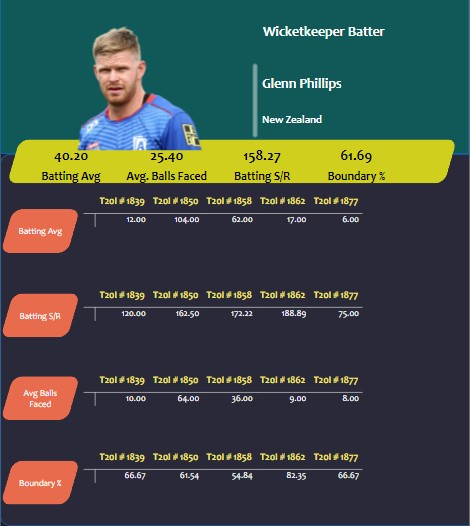
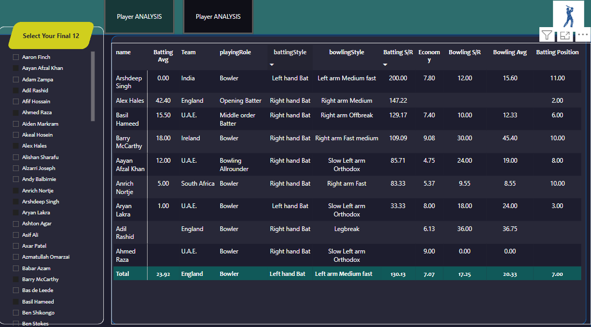

# Power BI Team Selection Report

This project demonstrates a Power BI report designed to help sports analysts select the top 11 players for a cricket team based on various performance metrics.

## Key Features

- **Player Performance Analysis**: Analyze player performances based on batting averages, strike rates, and boundary percentages.
- **Combined Performance Visualization**: Visualize how players perform across different roles such as All-Rounder, Finisher, and Bowler.
- **Final Team Selection**: Select and compare players to build the final team.

## Dashboard Previews

### Player Performance Analysis

*The dashboard analyzes top performers across various metrics.*

### Combined Performance Visualization

*Shows combined performance of selected players.*

### Tooltip to see individual player's performance across varous metrics

### Final team of 11 selected players 

*Comparison of bowling performance metrics.*

## Full Report

You can download and view the full detailed report in PDF format:
[Download PDF Report](./cricrefresh.pdf)

---

### How to Use
1. Open the Power BI dashboard.
2. Select players based on different criteria (batting, bowling, fielding).
3. Use filters to narrow down players based on their performance.

---

## Tech Stack

- Power BI
- Data from international cricket tournaments

## License

This project is licensed under the MIT License.
